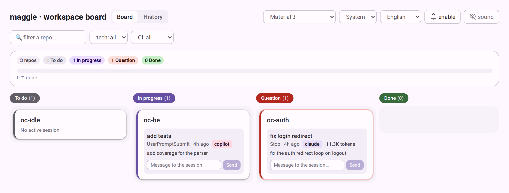
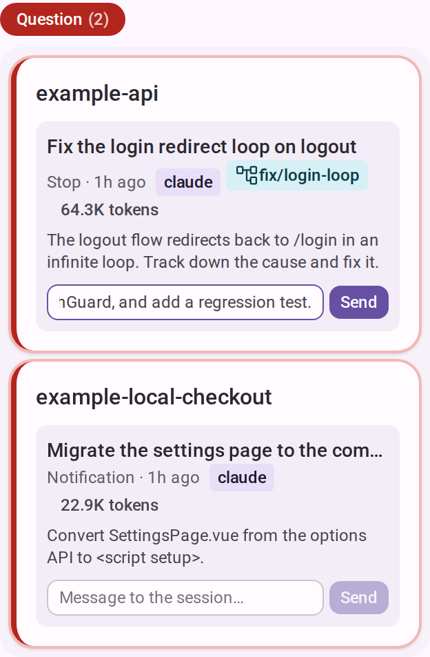
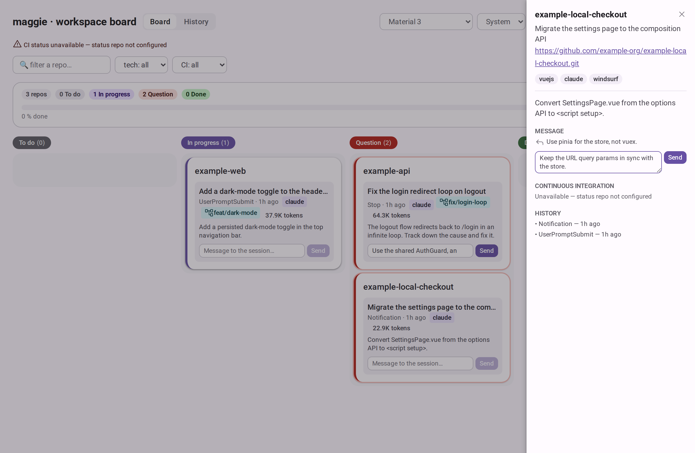
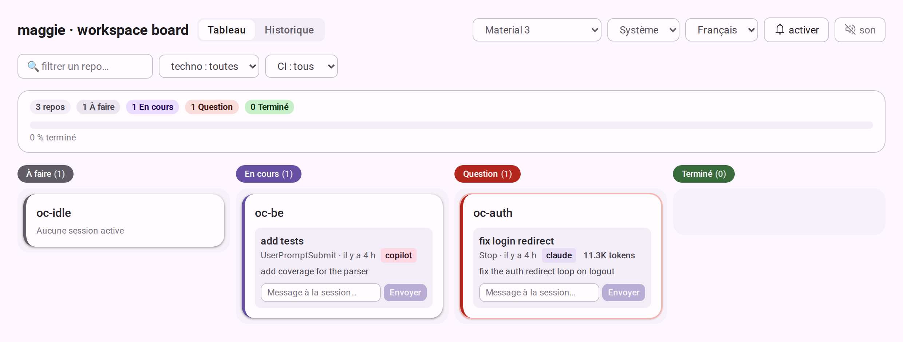
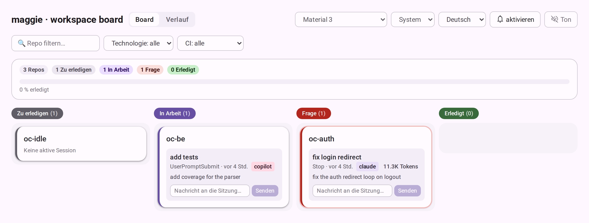
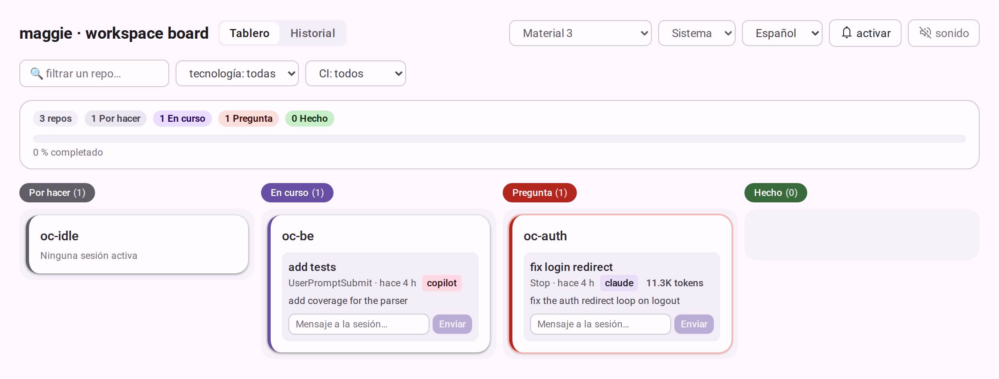
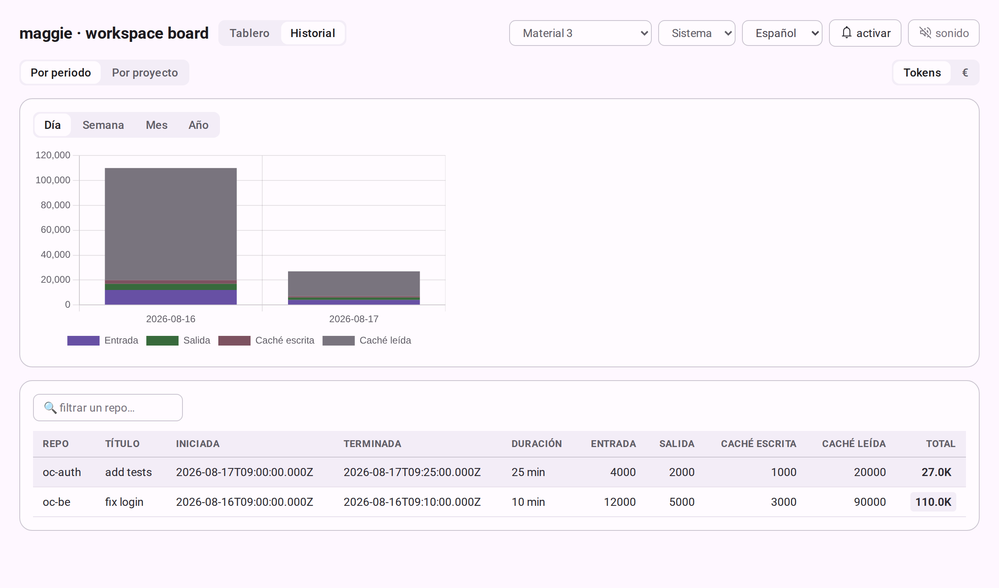

# Board dashboard

A read-only kanban dashboard (Vue 3 + Tailwind) showing each repo's status, fed
by the `board.json` that [`maggie-workspace` status tracking](workspace-cli.md#status-tracking)
writes. It lives in `apps/board/` with a zero-dependency Node server.

## Running it

`npm start` builds the front-end and then serves it:

```bash
npm start                                          # build + serve on http://localhost:4180
npm start -- --board /tmp/board.json               # a specific board file
AI_SYNC_BOARD=/tmp/board.json npm start            # board path via env
npm start -- --board /tmp/board.json --port 8080   # custom port
npm start -- --config repos.example.json           # also serve repo metadata
npm run board:build                                # build only, no server
```

### Flags

| Flag | Env | Default |
|---|---|---|
| `--board <path>` | `AI_SYNC_BOARD` | auto-detected, see below |
| `--config <path>` | `AI_SYNC_CONFIG` | none — degraded mode |
| `--port <n>` | — | `4180` |
| `--dist <path>` | — | the built front-end next to the server |

CI status adds five more flags — see [CI status](ci-status.md).

### Board path resolution

First match wins:

1. `--board <path>`
2. `AI_SYNC_BOARD`
3. auto-detected `wk/.maggie/board.json`
4. `board.json` in the current directory

So a plain `npm start` from the repo root picks up a live `wk/` workspace
automatically; `--board` / `AI_SYNC_BOARD` is only needed for a workspace
elsewhere. The startup log prints the resolved path (`board on … (data: …)`) —
check it first if the board looks empty.

If the chosen port is already in use the server falls back to the next free one
and prints where it settled, so avoid starting a second instance by accident.

## Endpoints

| Endpoint | Serves |
|---|---|
| `GET /api/board` | The raw `board.json`. Returns an empty board when the file does not exist. |
| `GET /api/config` | Repo metadata (url, technologies, targets) when started with `--config`. |
| `GET /api/ci` | Per-contributor CI status — see [CI status](ci-status.md). |
| `POST /api/sessions/close` | Closes a session: removes it from the board and appends a history entry. Body: `{ repo, sessionId }`. |
| `POST /api/sessions/message` | Queues a message for a session (see [Messaging a session](#messaging-a-session)). Body: `{ repo, sessionId, message }`. |
| anything else | The built front-end, with an SPA fallback to `index.html`. |

## `board.json`

```json
{
  "version": 1,
  "repos": {
    "example-api": {
      "status": "inprogress",
      "updatedAt": "2026-07-29T18:41:00.000Z",
      "lastEvent": "UserPromptSubmit",
      "events": [{ "event": "UserPromptSubmit", "at": "2026-07-29T18:41:00.000Z" }]
    }
  }
}
```

`status` is one of `todo`, `inprogress`, `question`, `done`. `events` is a
bounded per-repo history (last 20, newest first). A session may also carry a
`pendingMessages` array (`[{ text, at }]`, last 20) holding messages queued from
the dashboard but not yet delivered — see [Messaging a session](#messaging-a-session)
— and an `agent` field naming the local agent that runs it (`claude` or
`copilot`; `null` on sessions recorded before the board tracked it).

The version stays `1`: `events` is additive and legacy files are backfilled
transparently on read. The dashboard only reads the file — writers work whether
or not the server is running.

## What the UI does



- **Four columns**, one per status.
- **Browser notification** plus a tab-title badge whenever a repo moves into
  `question` (an agent is blocked on you) or `done`. An optional sound toggle is
  off by default and persisted in `localStorage`.
- **Summary header** with per-status counts and a done-progress bar.
- **Filter bar** narrowing by repo name, technology, or CI state.
- **Detail side panel** on click: repo URL, technology and target chips, CI
  breakdown per contributor, the event timeline, and a **message box** to send a
  message to the session (see below).
- **Message box** on each session card (and in the detail panel) to send a
  message to that session — see [Messaging a session](#messaging-a-session).
- **Agent badge** on each session row naming the local agent behind it —
  `claude` (Claude Code) or `copilot` (GitHub Copilot CLI) — so a workspace
  mixing both stays readable. Sessions recorded before the board tracked the
  agent show as `claude`.
- **Language picker** in the header: English (the default), French, German and
  Spanish. See below.

## Messaging a session

An agent that moves to `question` is blocked waiting on you. Rather than
switching back to the terminal where the session runs, you can type a reply from
the board — from the input on the session card, or in the detail side panel,
which also lists any messages still queued.





Sending posts `{ repo, sessionId, message }` to `POST /api/sessions/message`.
The server appends the message to that session's `pendingMessages` queue in
`board.json` (bounded to the last 20). Because maggie only observes sessions
through the agent's own hooks — it never drives them — the message is not pushed
into a live terminal. It is **delivered on the session's next turn**, through
whichever hook the agent lets write back into the conversation:

| Agent | Delivered by | How |
|---|---|---|
| Claude Code | `UserPromptSubmit` | The hook prints the queued messages to stdout, which Claude Code adds to the conversation context. |
| GitHub Copilot CLI | `sessionStart` and `notification` | Copilot drops the stdout of a `userPromptSubmitted` hook, so the queue is drained on the two events whose output it does honour, and returned as `{"additionalContext": "…"}` — which Copilot injects as a prepended user message. |

Under Copilot that means a message typed while the agent sits blocked on a
permission prompt or idle reaches it on that notification, without waiting for
you to type the next prompt. The `messages` subcommand
(`maggie-workspace messages <repo> --agent copilot`) is the delivery-only entry
point the `sessionStart` hook uses; it drains the queue without touching the
session's status.

## Language

The interface ships in English by default — a fresh browser always starts in
English, regardless of the OS or browser language. The header picker switches
the whole UI (columns, filters, banners, history table and charts, notification
bodies, relative times) to French, German or Spanish, and the choice is
persisted in `localStorage` under `maggie:locale` and re-applied on the next
visit. Switching also updates `<html lang>`.

The same board in French, German and Spanish:





Charts and the history table follow along — the Chart.js series are relabelled
and redrawn on a language change:



Translations live in `apps/board/src/locales/<code>.js`, keyed by flat dotted
keys, with `en.js` as the source catalog: a key missing from another locale
falls back to its English text rather than showing the key. To add a language,
drop a catalog next to the others, register it in `MESSAGES` and `LOCALES` in
`apps/board/src/i18n.js`, and the picker gains an entry. Repo data (names,
session titles, prompts, CI branches) is never translated.

Without `--config` the board still runs, in a degraded mode with no repo links
and no technology filter.

## Hook reconciliation on start

When started with `--config`, the server re-verifies every configured repo's
status hooks and silently repoints any that drifted — a CLI path that moved, or
hooks writing to a different `board.json` than the one being served. Each
checkout is reconciled for the agents it is already wired for, detected from the
settings files present (`.claude/settings.local.json`,
`.github/copilot/settings.local.json`), falling back to Claude Code when it has
neither; the log line names the agent. Repos with no checkout on disk are
skipped; nothing is cloned and no dependencies are installed. A short summary is
logged.

This exists because both kinds of drift are invisible otherwise: the symptom is
a card that simply never moves.
