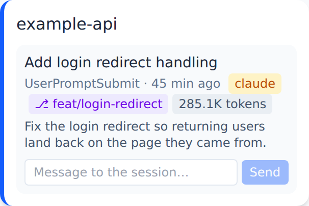

# `maggie-workspace` CLI

Clones the configured repos into one workspace folder, installs their
dependencies, wires up kanban status tracking, and prints the command to open
the workspace in Claude Code, GitHub Copilot CLI or VS Code.

Examples call the CLI through its source entry
(`node apps/workspace/bin/workspace.js`). Once installed it is `maggie-workspace`.

## Bootstrap

```bash
CFG="--config-repo https://github.com/example-org/ai-config.git"

node apps/workspace/bin/workspace.js $CFG --workspace ~/work/myorg
```

Dependency install is detected per repo from `package.json` (Node, via `pnpm`)
or `pom.xml` (Java, via `mvn dependency:go-offline`), and is cache-first —
`pnpm --prefer-offline`, Maven resolving `~/.m2` first — so a slow network stays
off the critical path.

Re-running against an existing folder reuses the checkouts already present and
refreshes their dependencies, so the same command both creates a workspace and
resumes one.

### Flags

| Flag | Meaning |
|---|---|
| `--workspace <path>` | Folder the repos are cloned into. |
| `--config` / `--config-repo` / `--config-file` | Config source — see [Configuration](configuration.md). |
| `--repo <name>` | Restrict to one repo. |
| `--agent <claude\|copilot>` | Which local agent's status hooks to install. Default `claude`. |
| `--editor <claude\|copilot\|vscode>` | Which launch command to print. Defaults to `--agent`. |
| `--worktree <branch>` | Isolate the work on a branch — see below. Not supported with `--editor vscode`. |
| `--no-install` | Skip dependency install. |
| `--offline` | Strict offline: fail if a dependency is not already cached. |
| `--dry-run` | Preview clone/install actions; no side effects, no hooks, no board seeding. |

```bash
node apps/workspace/bin/workspace.js $CFG --workspace ~/work/myorg --agent copilot
node apps/workspace/bin/workspace.js $CFG --workspace ~/work/myorg --editor vscode
node apps/workspace/bin/workspace.js $CFG --workspace ~/work/myorg --repo example-api
node apps/workspace/bin/workspace.js $CFG --workspace ~/work/myorg --no-install
node apps/workspace/bin/workspace.js $CFG --workspace ~/work/myorg --offline
node apps/workspace/bin/workspace.js $CFG --workspace ~/work/myorg --dry-run
```

## Worktrees

`--worktree <branch>` runs `git worktree add <repo>.<branch>` next to each
checkout, installs dependencies inside the worktree, and points the launch
command at it. Re-running reuses an existing worktree. Without the flag the tool
prints a tip suggesting it.

```bash
node apps/workspace/bin/workspace.js $CFG --workspace ~/work/myorg --worktree feat/login
# → adds example-api.feat-login/, then prints:
#   cd "~/work/myorg/example-api.feat-login" && claude
```

`--agent copilot` prints `cd "…" && copilot` instead.

When a checkout runs in a worktree, its status hooks are wired with
`--worktree <branch>`, so every session started there records the branch on the
board and its card shows a worktree badge (see [Status tracking](#status-tracking)).



## Status tracking

Bootstrap wires each checkout to report its kanban status into a shared
`board.json` at `<workspace>/.maggie/board.json`. The four states are `todo`,
`inprogress`, `question` and `done`.

It works by merging hooks into each repo's agent settings file, so a running
session updates the board by itself. Which file and which events depends on the
agent the workspace was bootstrapped for.

**Claude Code** (`--agent claude`, the default) — `.claude/settings.local.json`:

| Hook event | New status | Meaning |
|---|---|---|
| `UserPromptSubmit` | `inprogress` | Work resumed. |
| `Notification` (permission or idle prompt) | `question` | Waiting on you. |
| `Stop` | `question` | Turn ended. |

**GitHub Copilot CLI** (`--agent copilot`) — `.github/copilot/settings.local.json`,
the user-specific, gitignored twin of the Claude file (Copilot also reads
committed `.github/hooks/*.json`, which maggie deliberately leaves alone):

| Hook event | New status | Meaning |
|---|---|---|
| `userPromptSubmitted` | `inprogress` | Work resumed. |
| `notification` (`permission_prompt`, `elicitation_dialog`, `agent_idle`) | `question` | Waiting on you. |
| `agentStop` | `question` | Turn ended. |

`sessionEnd` (Copilot) and `SessionEnd` (Claude Code) both close the session:
the card leaves the board and a history entry is written. Copilot's
`sessionStart` is wired to the `messages` subcommand — see
[Messaging a session](board-dashboard.md#messaging-a-session).

Token usage is read back from whatever the agent hands over on the end-of-turn
event: Claude Code's transcript JSONL, or Copilot's
`~/.copilot/session-state/<id>/events.jsonl` event stream, whose `inputTokens` /
`outputTokens` / `cacheReadTokens` / `cacheWriteTokens` are mapped onto the same
four board counters.

Each hook shells out to this CLI's `status` subcommand, which you can also run
by hand:

```bash
node apps/workspace/bin/workspace.js status example-api done --board ~/work/myorg/.maggie/board.json
# installed on PATH:
maggie-workspace status example-api done --board <board.json>

# Copilot hooks pass --agent copilot, which switches the payload format,
# the usage reader and the stdout contract:
maggie-workspace status example-api question --board <board.json> \
  --event agentStop --agent copilot
```

The board is seeded with `todo` for every repo at bootstrap and updated
atomically. Hook install and seeding are skipped under `--dry-run`.

Only repos listed in the config are tracked — a directory created under the
workspace by hand gets no hooks and never appears on the board. A repo pointing
at an existing checkout through `path` is tracked on the same board exactly like
one cloned into the workspace.

### Hook reconciliation

The board server re-verifies these hooks on every start and repoints any that
drifted — a stale CLI path, or a repo whose hooks write to a different
`board.json` than the one being displayed. It reconciles whichever agents a
checkout is already wired for, detected from the settings files present, and
falls back to Claude Code for a checkout that has neither. See
[Board dashboard](board-dashboard.md).

To see the board in a browser, point the dashboard server at this same file.
